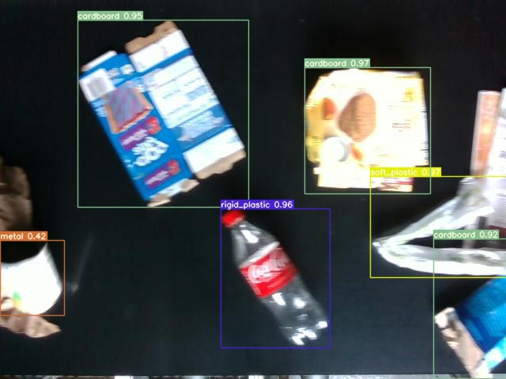
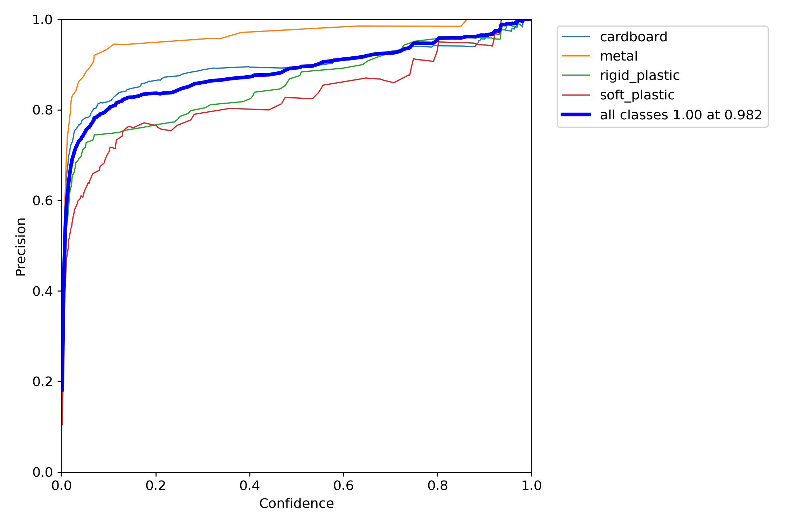

# Green Sorter  

This model is designed to detect recyclable materials in real-time with high accuracy. By using YOLOV7, this model is able to accurately classify various types of materials, including cardboard, metal, rigid plastic, soft plastic. This allows companies and organizations to more effectively sort and recycle their waste, reducing their environmental impact and saving valuable resources. This model can be easily integrated into existing waste management systems and has the potential to greatly improve recycling efficiency. With the increasing importance of sustainability and the need to reduce waste, this AI is a valuable tool for businesses and organizations looking to make a positive impact on the environment.
## Installation

Clone repo

```bash
  git clone https://github.com/1nfinityLoop/GreenSorter
```

Download model 


[`Download`](https://github.com/1nfinityLoop/GreenSorter/releases/download/v0.1/model.pt)


## Testing

Clone repo

```bash
  python yolov7/detect.py --weights model.pt --source "video.mp4"

```

## Dataset


For the training of this model I used the dataset I found [here](https://universe.roboflow.com/kaitlyn-fichtner-nv5um/lab-trash-v2.0) 

you can also find training, validation and test data in this repo 


```bash
Train: train/images

Val: valid/images

Test: test/images

nc: 4

Names: ['cardboard', 'metal', 'rigid_plastic', 'soft_plastic']
```
## Results
 <br><br>
Output :
 <br><br>



<br><br><br><br>
Precision : 
<br><br>


